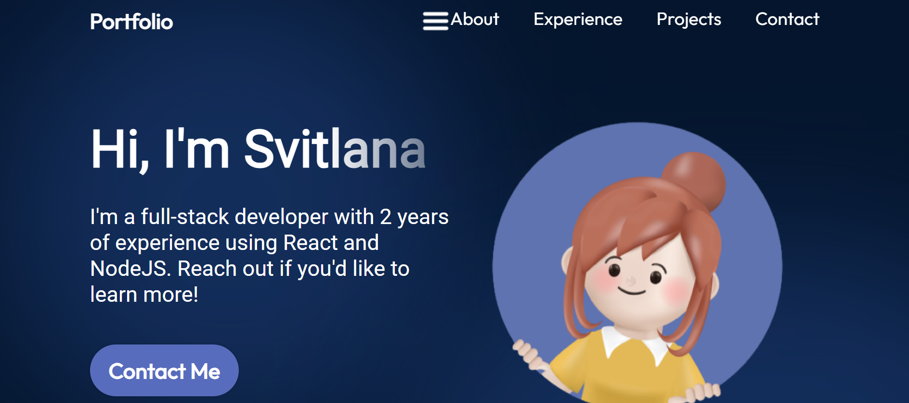
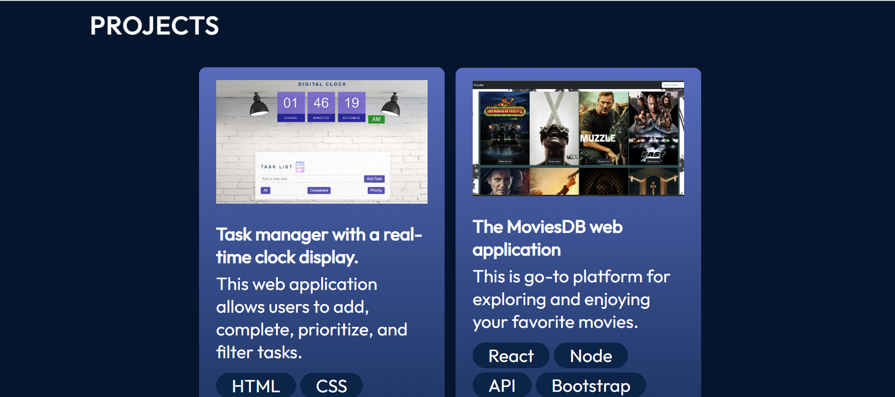

# Portfolio

[a link to the live site](https://portfolio-pysa.onrender.com)

## Overview

Responsive Portfolio Website from Scratch using React and CSS animations.

## Tech/framework used

Built with: React, CSS, Visual Studio Code

## Features

- **Navbar**
- **Hero**
- **About**
- **Experience**
- **Projects**
- **Contact**

## Getting Started

1. Clone this repository to your local machine:

git clone https://github.com/LanaSvet11/portfolio.git

2. Open the index.html file in your web browser to launch the application.

## Contributing

Contributions are welcome! If you find any issues or have suggestions for improvements, please open an issue or create a pull request.

## License

This project is licensed under the MIT License. See the [LICENSE file](./MIT%20License.txt) for details.

## Contact

If you have any questions or suggestions, please feel free to contact us:

Email: holovatenko.dev@gmail.com
LinkedIn: https://www.linkedin.com/in/svitlana-holovatenko/
